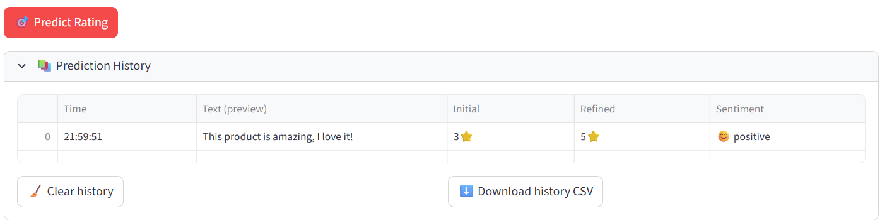

# AI Star Rating Prediction for Supply Chain

Predict 1–5★ ratings from Trustpilot review text (Temu focus) using classic ML and Deep Learning.
Includes a Streamlit app for live predictions, model comparison, and a 100-sample quick evaluation.

Live demo: https://supply-chain-ai-star-prediction.streamlit.app

# What this project does

* Uses Trustpilot reviews (English) and cleans/normalizes the text
* Engineers features (TF-IDF + light numeric text signals + optional VADER)
* Trains & compares multiple models (LogReg, LinearSVC, XGBoost, Voting/Stacking + DL variants)
* Serves a Streamlit app for instant star-rating prediction and model inspection
* More visuals & PDFs live in /documentation/.
  
## Quick preview

# Mashine learning

  

  
  

    

# Deep learning

  
  

